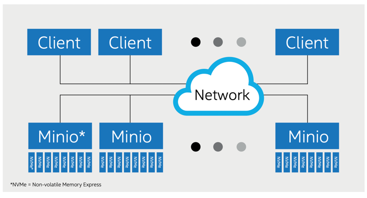
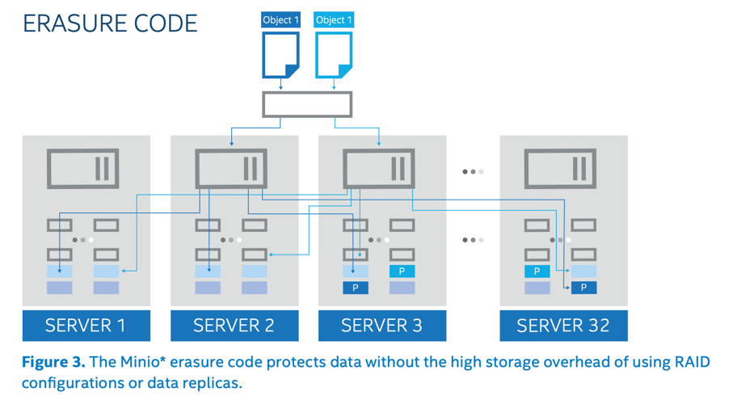
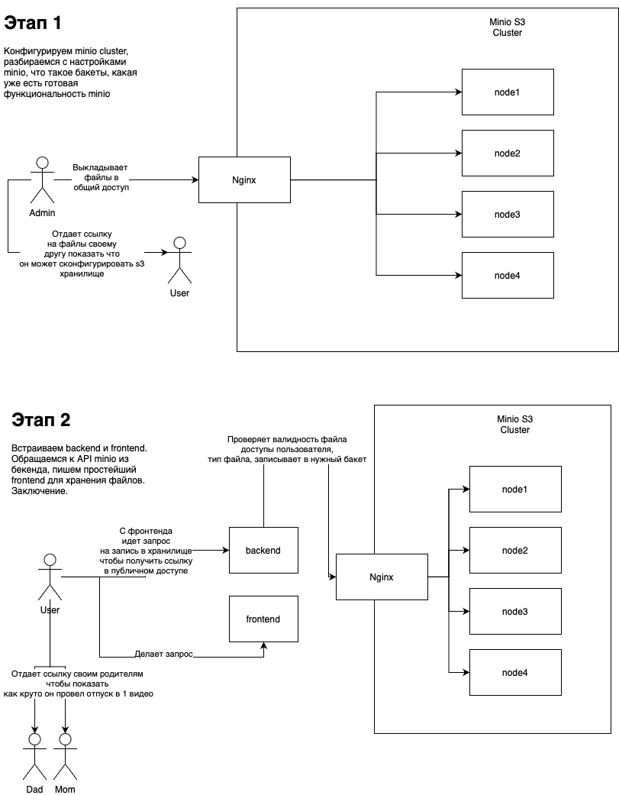

# Методические указания по выполнению дз ст [S3 хранилища]
В данном домашнем задании мы познакомимся с хранилищем S3,
обсудим зачем оно нужно, как работает и как правильно его настрить и использовать.
Необходимо настроить файловое хранилище S3 
и разработать методы доступа к нему. Хранилище необходимо для синхронизации двух узлов (условные клиент и сервер облака). Должна быть предусмотрена синхронизация, если одна из версий устарела (на клиенте не было интернета)

## Этап №1
### План:
1. Установить docker
2. Что такое S3. Почему не сохранять все просто на диск?
3. Разобрать конфигурацию кластера s3 в docker-compose и установить.
4. Разобраться во внутренней конфигурации панели администратора minio
5. Бакеты. Создать свой первый бакет, загрузить файл и сгенерировать ссылку на файл в хранилище.

### 1. Установка docker
Полезные материалы:
- Про docker: https://habr.com/ru/post/310460/?ysclid=l7ilstl2mt144186154
- Официальная документация docker: https://docs.docker.com/get-started/overview/

Для начала введем для себя 3 определения:
* Docker - Программное обеспечение для автоматизации развёртывания и управления приложениями в средах с поддержкой контейнеризации, контейнеризатор приложений. Позволяет «упаковать» приложение со всем его окружением и зависимостями в контейнер.
  Говоря простым языком - это программа, позволяющая упаковывать ваши приложения так, чтобы вы не замечали разницу между языками,
  легко обменивались программным обеспечением.
* Docker контейнер - сущности,
  которые предоставляют схожий с виртуальными машинами уровень изоляции,
  но благодаря правильному задействованию низкоуровневых механизмов основной операционной системы делают это с в разы меньшей нагрузкой.
* Docker image - "образ" какого-то контейнера, контейнер который один разработчик передает другому в формате image`a


Приступим непосредственно к установке:
Один из самых важных навыков программиста - способность читать и понимать то, что вы должны сделать,
потому постараюсь обойти подробную информацию о том как нажать на кнопочку скачать и как переводить тест на сайте.

[Windows](https://docs.docker.com/desktop/install/windows-install/)
[Linux](https://docs.docker.com/desktop/install/linux-install/)
[MacOS](https://docs.docker.com/desktop/install/mac-install/)

Проверим его работоспособность:

Откройте консоль. Введите команду
```shell
$ docker version
Client:
 Cloud integration: v1.0.22
 Version:           20.10.12
 API version:       1.41
 Go version:        go1.16.12
 Git commit:        e91ed57
 Built:             Mon Dec 13 11:46:56 2021
 OS/Arch:           darwin/arm64
 Context:           default
 Experimental:      true

Server: Docker Desktop 4.5.0 (74594)
 Engine:
  Version:          20.10.12
  API version:      1.41 (minimum version 1.12)
  Go version:       go1.16.12
  Git commit:       459d0df
  Built:            Mon Dec 13 11:43:07 2021
  OS/Arch:          linux/arm64
  Experimental:     false
 containerd:
  Version:          1.4.12
  GitCommit:        7b11cfaabd73bb80907dd23182b9347b4245eb5d
 runc:
  Version:          1.0.2
  GitCommit:        v1.0.2-0-g52b36a2
 docker-init:
  Version:          0.19.0
  GitCommit:        de40ad0
```
Если вдруг по какой-то причине вы видите ошибку, например:
```shell
Cannot connect to the Docker daemon at unix:///var/run/docker.sock. Is the docker daemon running?
```
Значит что-то пошло не так, если вы не найдете свою проблему в FAQ, постарайтесь сначала поискать ее в интернете.

Вместе с программой докер, к вам должен был установиться docker compose. Проверим его установку:
```shell
$ docker compose version
Docker Compose version v2.2.3
# или, возможно, у вас сработает эта команда
# проблема различия возникает из-за версии приложения и ОС
$ docker-compose version
docker-compose version 1.29.2, build 5becea4c
docker-py version: 5.0.0
CPython version: 3.9.0
OpenSSL version: OpenSSL 1.1.1h  22 Sep 2020
```

### 2. Что такое S3. Почему не сохранять все просто на диск?
S3 - облачный сервис для надежного хранения любых типов данных, резервного копирования и архивирования.

Для каких задач подходит «Объектное хранилище S3»?
* Хранение файлов, необходимых для работы сайтов и мобильных приложений.
* Создание архивов больших объемов данных.
* Хранение статического контента и мультимедийных файлов.
* Хранение пользовательских данных и резервных копий.
* Раздача статических файлов.
* Хранение данных backend-платформ.
* Интеграция с системами электронного документооборота.
* Хранение лог-файлов.

Почему просто не сохранять файлы на диск? 

Ответ достаточно прост: 

* отсутсвие простого горизонтального масштабирования(вы конечно можете использовать протоколы по типу sftp и отправлять файлы на разные машины, но это определенно требует новых доработок со стороны кода)
* отсуствие встроенной репликации данных(придется решать эту проблему своими силами)
* сложная и проблематичная интеграция
* надженость хранения(что произойдет если 1 диск на котором вы хранили файлы сломается?)

Архитектура minio же изначально поразумевает автоматическую реплизацию(они повторяются елси один из серверов сломался, ответит второй. все конечно зависит от фактора репликации - количество копий, которые вы будете хранить) ваших данных.



### 3. Разобрать конфигурацию кластера s3 в docker-compose и установить.
Давайте составим архитектуру проекта, который будем конфигурировать для 1 этапа:


Нам подребуется веб сервер nginx, который будет работать в режиме балансировщика кластера. Он будет переадресовывать ваши запросы внутрь кластера minio 

В корне данного проекта вы можете найти файл ```docker-compose.yaml```. 
В нем находится следующее:
```yaml
version: '3.7'

# Settings and configurations that are common for all containers
x-minio-common: &minio-common
  image: quay.io/minio/minio:RELEASE.2022-10-15T19-57-03Z
  command: server --console-address ":9001" http://minio{1...4}/data{1...2}
  environment:
    MINIO_ACCESS_KEY: minio
    MINIO_SECRET_KEY: minio124
  expose:
    - "9000"
    - "9001"
    # environment:
    # MINIO_ROOT_USER: minioadmin
    # MINIO_ROOT_PASSWORD: minioadmin
  healthcheck:
    test: ["CMD", "curl", "-f", "http://localhost:9000/minio/health/live"]
    interval: 30s
    timeout: 20s
    retries: 3

# starts 4 docker containers running minio server instances.
# using nginx reverse proxy, load balancing, you can access
# it through port 9000.
services:
  minio1:
    <<: *minio-common
    hostname: minio1
    volumes:
      - data1-1:/data1
      - data1-2:/data2

  minio2:
    <<: *minio-common
    hostname: minio2
    volumes:
      - data2-1:/data1
      - data2-2:/data2

  minio3:
    <<: *minio-common
    hostname: minio3
    volumes:
      - data3-1:/data1
      - data3-2:/data2

  minio4:
    <<: *minio-common
    hostname: minio4
    volumes:
      - data4-1:/data1
      - data4-2:/data2

  nginx:
    image: nginx:1.19.2-alpine
    hostname: nginx
    volumes:
      - ./nginx.conf:/etc/nginx/nginx.conf:ro
    ports:
      - "9000:9000"
      - "9001:9001"
    depends_on:
      - minio1
      - minio2
      - minio3
      - minio4

## By default this config uses default local driver,
## For custom volumes replace with volume driver configuration.
volumes:
  data1-1:
  data1-2:
  data2-1:
  data2-2:
  data3-1:
  data3-2:
  data4-1:
  data4-2:
```
Давайте разберемся с каждой строчкой которая была употреблена, чтобы для вас это не казалось магией.
## Этап №2

